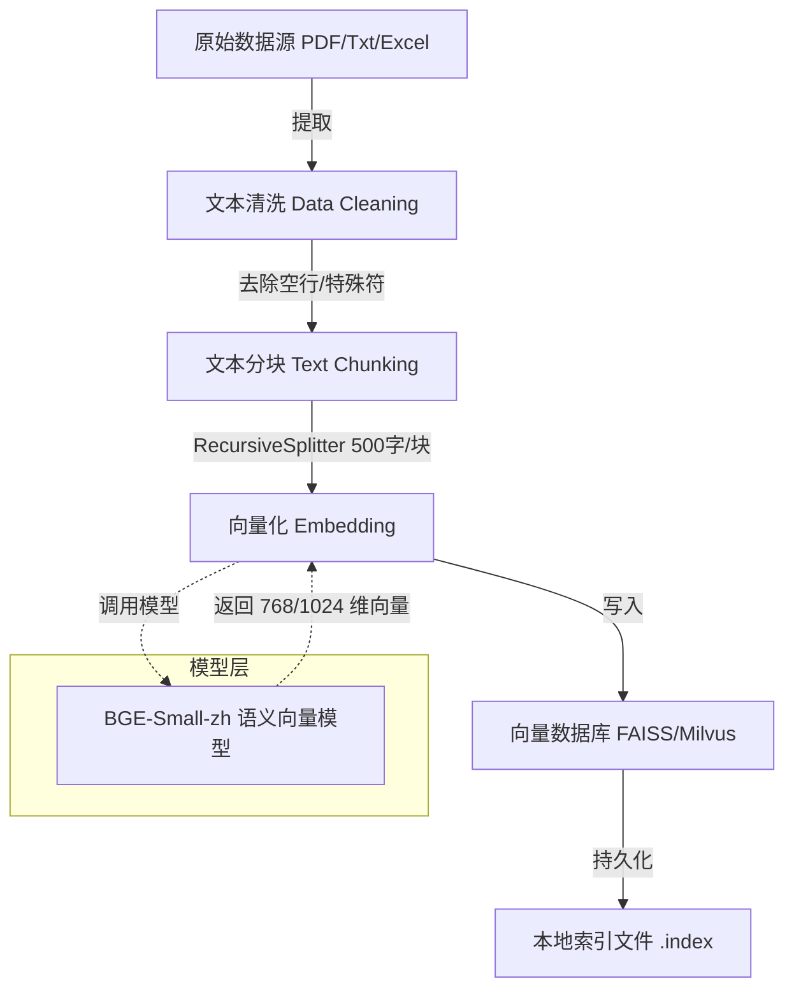

## JD agent 


## use

- backend server lib install

```shell

# server start
uvicorn app.main:app --reload

pip install fastapi uvicorn langchain langchain-openai pydantic python-dotenv

pip install faiss-cpu sentence-transformers flask-sqlalchemy pymysql
```

- rag 知识库入库



- 添加个人博客进入知识库

```shell
pip install langchain-community langchain-text-splitters faiss-cpu sentence-transformers tqdm

数据源 (Source): 本地博客目录（Hexo/Hugo 等生成的 source/_posts/*.md）。
加载器 (Loader): 遍历目录，读取所有 .md 文件。
清洗与切分 (Splitter): 针对 Markdown 格式（标题、代码块）进行特殊切分。
向量化 (Embedding): 使用 BGE 模型（符合 JD 要求）。
存储 (Vector DB): 使用 FAISS 存储向量索引。
检索与生成 (Retrieval & Chat): 检索相关文档 -> 喂给 DeepSeek/OpenAI -> 生成答案。

# BRE model download
hf download BAAI/bge-small-zh-v1.5

python build_blog_kb.py
python query_blog.py

```

- web

```shell
npx create-next-app@latest jd-chat-ui
cd jd-chat-ui
npm install react-markdown lucide-react clsx tailwind-merge
# 在 jd-chat-ui 目录下
npm install -D @tailwindcss/typography
npm install -D tailwindcss@3.4.17 postcss autoprefixer
#npm install -D tailwindcss postcss autoprefixer
npx tailwindcss init -p
npm run dev
```

- mirror

```shell
# venv
python -m venv .venv
# venv activate
source .venv/bin/activate
# lib
pip install -r requirements.txt -i https://mirrors.tuna.tsinghua.edu.cn/pypi/web/simple --trusted-host mirrors.tuna.tsinghua.edu.cn --proxy http://192.168.10.123:7890
# gpu 
pip install torch torchvision torchaudio --index-url https://download.pytorch.org/whl/cu118
# 使用（v1.0.5以后）
python ./src/run/main.py
# 或 (v1.0.5以前)
python ./src/run/main_process.py
```