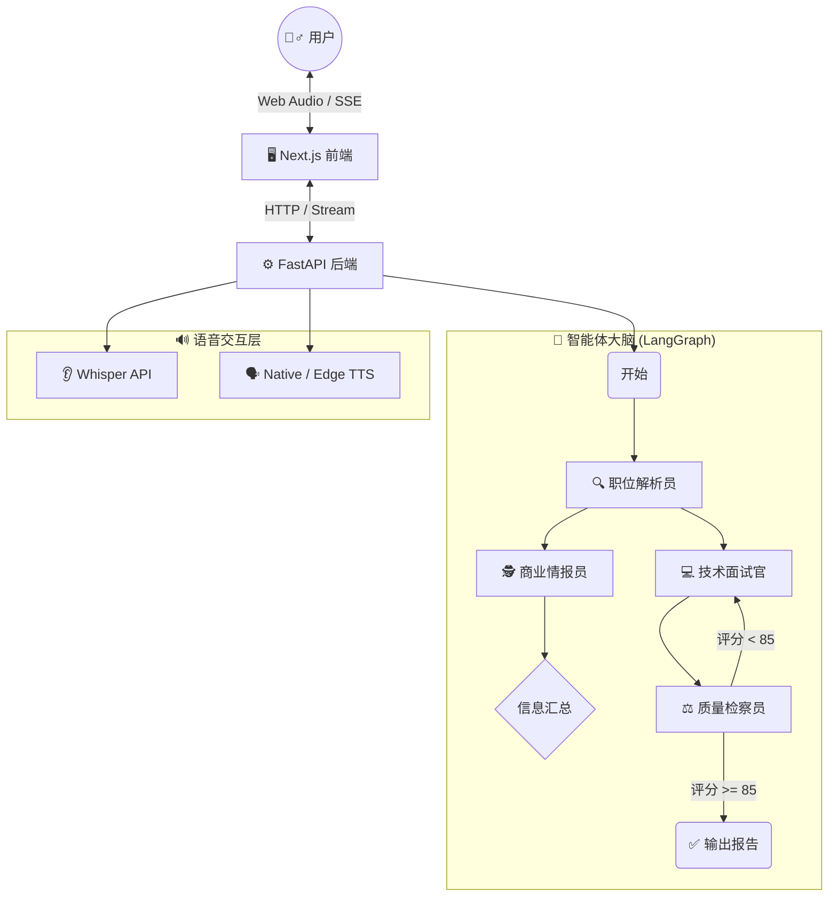

# 🚀 JD Agent: 全栈 AI 模拟面试官 (L5 Autonomous Agent)


> **JD Agent** 是一个基于 **多智能体协同 (Multi-Agent Swarm)** 的全栈 AI 应用。它不仅能深度解析岗位描述 (JD) 生成突击指南，还能化身为**全双工语音交互**的面试官，进行实时的模拟面试。

---

## ✨ 核心特性 (Key Features)

### 🧠 1. L5 级多智能体协同 (LangGraph)
摒弃了传统的线性工作流，构建了一个具备**自我反思与纠错能力**的虚拟团队：
- **🕵️ Researcher**: 自动联网 (Tavily) 搜索公司背景、财报与业务动态。
- **💻 Tech Lead**: 基于 JD 技术栈构建硬核面试题。
- **⚖️ Reviewer (质检员)**: 审核题目质量，评分低于 85 分自动打回重写 (Self-Correction)。
- **👨‍💼 Human Approval Node**: 支持人工介入审核流程，提供交互式反馈和状态跟踪。
- **🧠 Brain Dashboard**: 前端实时可视化 Agent 的思维流转、当前步骤、用户画像标签云和知识库引用相关性评分，优化了步骤进度指示器，提供更直观的状态展示。

### 🔊 2. 全双工语音交互 (Real-time Voice)
打造“听得见、说得出”的沉浸式体验：
- **👂 ASR (听)**: 集成 **SiliconFlow / Whisper**，实现秒级语音转文字。
- **🗣️ TTS (说)**: 
    - **macOS**: 调用原生 `say` 命令，零延迟、零成本。
    - **Windows/Linux**: 使用 `pyttsx3` 并通过 `asyncio.to_thread()` 实现异步处理，避免主线程阻塞。
    - **📱 跨平台兼容**: 自动将平台特定格式 (.m4a/.wav) 转换为统一 MP3 格式。
- **⚡️ 增强型音频队列 (Audio Queue)**: 
    - 分句缓冲与串行播放，解决流式生成导致的语音重叠问题。
    - 支持加载状态、错误处理、暂停/恢复功能。
    - 实时队列状态反馈（播放中、队列长度等）。

### 🎨 3. DeepSeek 风格交互 UI
- **深度思考模式**: 实时展示 AI 的思考过程（Thinking Stream），缓解长推理时间的等待焦虑。
- **流式打字机**: 基于 SSE (Server-Sent Events) 实现极速首字响应。
- **Markdown 渲染**: 完美渲染结构化报告、代码块与表格。

### 💾 4. 长期记忆系统 (Memory)
- **简历解析**: 上传 PDF/Word 简历，自动提取画像存入 SQLModel 数据库。
- **会话回溯**: 侧边栏管理历史会话，AI 永远记得你的技术栈偏好。

### � 5. 团队协作管理 (Team Management)
- **团队创建与邀请**: 支持创建团队并通过邀请码邀请成员加入。
- **角色权限体系**: 三级角色权限 (Owner/Admin/Member) 管理团队资源。
- **成员管理**: 团队所有者和管理员可管理成员列表和权限。
- **资源隔离**: 团队数据自动隔离，支持多租户场景。

### 📊 6. 面试报告导出 (Report Export)
- **多格式导出**: 支持 Markdown、HTML、纯文本三种格式导出面试报告。
- **历史记录管理**: 查看和管理历史导出记录。
- **Unicode 文件名支持**: 完美支持中文字符的文件名编码。
- **流式内容生成**: 实时生成报告内容，支持大文件处理。

### � 7. 智能日志系统
- **前端日志自动保存**: 集成开源日志库 loglevel，自动将前端日志保存到服务器指定目录
- **日志分级与分类**: 按级别（trace、debug、info、warn、error）和类别（stream、auth、ui、network、state、component、general）组织日志
- **日志轮转与清理**: 自动管理日志文件大小，超过10MB时轮转，7天后自动清理
- **日志查看与分析**: 提供强大的日志过滤、搜索和导出功能，支持多种格式（JSON、CSV、文本、统计报告）

---

## 🏗️ 技术架构 (Architecture)


```mermaid
graph TD
    User((🙍‍♂️ 用户)) <-->|Web Audio / SSE| Frontend[🖥️ Next.js 前端]
    Frontend <-->|HTTP / Stream| Backend[⚙️ FastAPI 后端]

    subgraph "🧠 智能体大脑 (LangGraph)"
        Start(开始) --> Parser[🔍 职位解析员]
        Parser --> Researcher[🕵️ 商业情报员]
        Parser --> TechLead[💻 技术面试官]
        
        Researcher --> Context{信息汇总}
        TechLead --> Reviewer[⚖️ 质量检察员]
        
        Reviewer -->|评分 < 85| TechLead
        Reviewer -->|评分 >= 85| End(✅ 输出报告)
    end

    subgraph "🔊 语音交互层"
        ASR[👂 Whisper API]
        TTS[🗣️ Native / Edge TTS]
    end

    Backend --> ASR
    Backend --> TTS
    Backend --> Start
```

---

## 🛠️ 快速开始 (Getting Started)

### 前置要求
- Python 3.10+
- Node.js 18+
- OpenAI / DeepSeek / SiliconFlow API Key

### 1. 后端设置 (Backend)

```bash
# 1. 进入项目目录
cd jd_agent

# 2. 创建虚拟环境并激活
python -m venv .venv
source .venv/bin/activate  # Windows: .venv\Scripts\activate

# 3. 安装依赖
pip install -r requirements.txt

# 4. 配置环境变量
cp .env.example .env
# 编辑 .env 填入你的 API Key (推荐使用 DeepSeek + SiliconFlow 组合)

# 5. 启动服务
cd src && uvicorn app.main:app --reload
# 服务将运行在 http://127.0.0.1:8000
```

**`.env` 配置示例：**
```ini
# LLM (大脑)
OPENAI_API_KEY=sk-deepseek-xxx
OPENAI_API_BASE=https://api.deepseek.com
MODEL_NAME=deepseek-ai/DeepSeek-V3

# Audio (感官 - 推荐 SiliconFlow 免费版)
AUDIO_API_KEY=sk-siliconflow-xxx
AUDIO_API_BASE=https://api.siliconflow.cn/v1
ASR_MODEL=FunAudioLLM/SenseVoiceSmall

# Search (联网)
TAVILY_API_KEY=tvly-xxx
```

### 2. 前端设置 (Frontend)

```bash
# 1. 进入前端目录
cd src/web/jd-chat-ui

# 2. 安装依赖
npm install

# 3. 启动开发服务器
npm run dev
```

**前端配置说明：**
- Next.js 开发服务器运行在 [http://localhost:3000](http://localhost:3000)
- 配置了 API 代理 (`next.config.js`)，将 `/api/v1/*` 请求转发到 `http://127.0.0.1:8000/api/v1/*`，解决跨域问题

打开浏览器访问 [http://localhost:3000](http://localhost:3000) 即可开始使用。

---

## 🖥️ 使用指南

### 模式一：JD 深度分析
1.  在输入框粘贴 **岗位描述 (JD)**。
2.  观察右侧 **Brain Dashboard**，查看 Agent 如何拆解任务、搜集情报。
3.  获取一份包含 **公司背景、技术必考题、HR 陷阱题** 的结构化报告。

### 模式二：模拟面试 (Mock Interview)
1.  分析完 JD 后，点击 **“🎤 开始模拟面试”** 按钮。
2.  AI 将切换为 **“严厉面试官”** 人设。
3.  **按住麦克风** 回答问题，AI 会识别语音并进行追问。
4.  开启右上角的 **语音开关**，体验全语音对话。

### 📝 模式三：日志系统管理
1. 访问日志系统测试页面：在浏览器中访问 `http://localhost:3000/logs`
2. 查看当前日志：使用页面上的日志查看器查看前端实时生成的日志
3. 测试日志功能：
   - 点击"生成测试日志"按钮创建示例日志
   - 切换"自动保存"开关启用/禁用日志自动保存
   - 调整"自动保存间隔"设置日志保存频率
   - 点击"手动保存日志"立即保存当前日志
   - 点击"测试服务器连接"验证与后端的连接
4. 导出日志：使用日志查看器的导出功能将日志保存为JSON、CSV或文本格式
5. 筛选与搜索：使用日志查看器的过滤功能按级别、类别、日期范围或关键词查找日志

---

## 📂 项目结构

```text
jd_agent/
├── src/
│   ├── app/                 # 后端应用
│   │   ├── api/             # FastAPI 路由接口 (Stream, Auth, Audio, Logs, Team, ReportExport)
│   │   ├── chains/          # LangChain 原子能力 (Generator, Parser)
│   │   ├── core/            # 核心配置 (Config, DB, LLM Factory) & 统一错误处理
│   │   ├── graph/           # LangGraph 多智能体编排 (Nodes, Workflow) - 含人工介入节点
│   │   ├── models/          # 数据模型 (User, Resume, Interview, Team, InterviewReport)
│   │   └── services/        # 业务逻辑层 (LLM Service, Report Export Service)
│   ├── web/                 # 前端应用
│   │   └── jd-chat-ui/      # Next.js 前端
│   │       ├── app/         # 页面组件 (包括日志系统测试页面 /logs)
│   │       ├── components/  # UI 组件 (ChatInput, BrainDashboard, AudioQueue, LogViewer)
│   │       ├── hooks/       # 自定义 Hooks (useChat, useAudio)
│   │       ├── types/       # TypeScript 类型定义
│   │       ├── utils/       # 工具库 (logger.ts - 日志系统核心实现)
│   │       └── next.config.js # Next.js 配置文件 (含 API 代理设置)
│   └── prompts/             # Prompt YAML 模板管理
├── logs/                    # 日志文件存储目录 (由后端API创建与管理)
├── tests/                   # 测试用例
├── requirements.txt         # 后端依赖列表
└── README.md                # 项目文档
```

---

## 🚧 开发计划 (Roadmap)

- [x] **v1.0**: JD 解析与题库生成 (RAG)
- [x] **v2.0**: 长期记忆 (User Profile) 与 鉴权系统
- [x] **v3.0**: L5 多智能体协同 & 全双工语音交互
- [x] **v3.1**: 低优先级优化
  - [x] TTS 异步处理 pyttsx3 调用，避免阻塞主线程
  - [x] 完善多智能体工作流人工介入机制
  - [x] 优化前端音频队列用户体验
  - [x] 统一系统全局错误处理机制
- [x] **v3.2**: 可视化与性能优化
  - [x] Brain Dashboard 可视化增强，优化步骤进度指示器
  - [x] API 代理配置优化，确保前后端通信稳定
  - [x] 系统兼容性增强，修复多平台依赖管理问题
- [x] **v3.3**: 代码质量与可维护性提升
  - [x] 修复测试文件中所有高优先级 flake8 错误（F541, E999, W293）
  - [x] 确保所有测试文件符合 PEP8 代码规范
  - [x] 改进代码缩进、字符串格式化和空白行处理
  - [x] 提升代码可读性和可维护性
- [x] **v3.4**: 智能日志系统
  - [x] 实现基于 loglevel 的前端日志系统
  - [x] 开发后端日志存储 API (logs.py)
  - [x] 实现日志文件轮转和自动清理功能
  - [x] 创建 LogViewer 组件用于日志查看和分析
  - [x] 开发日志系统测试页面 (/logs)
- [x] **v3.5**: 团队协作管理
  - [x] 实现团队创建、成员邀请功能
  - [x] 实现三级角色权限体系 (Owner/Admin/Member)
  - [x] 开发团队管理 API 端点
  - [x] 实现团队资源数据隔离
- [x] **v3.6**: 面试报告导出
  - [x] 开发多格式报告导出功能 (Markdown/HTML/Text)
  - [x] 实现 Unicode 文件名编码支持
  - [x] 创建导出记录管理功能
  - [x] 开发流式内容生成支持
- [ ] **v4.0**: WebRTC 超低延迟通话 (打断式交互)
- [ ] **v5.0**: 多模态简历分析 (支持图片/PDF 图表读取)

---

## 🤝 贡献 (Contribution)

欢迎提交 Issue 或 Pull Request！
如果你喜欢这个项目，请给一个 ⭐️ Star！

## 📄 开源协议 (License)

MIT License © 2025 CaoZhaoQi